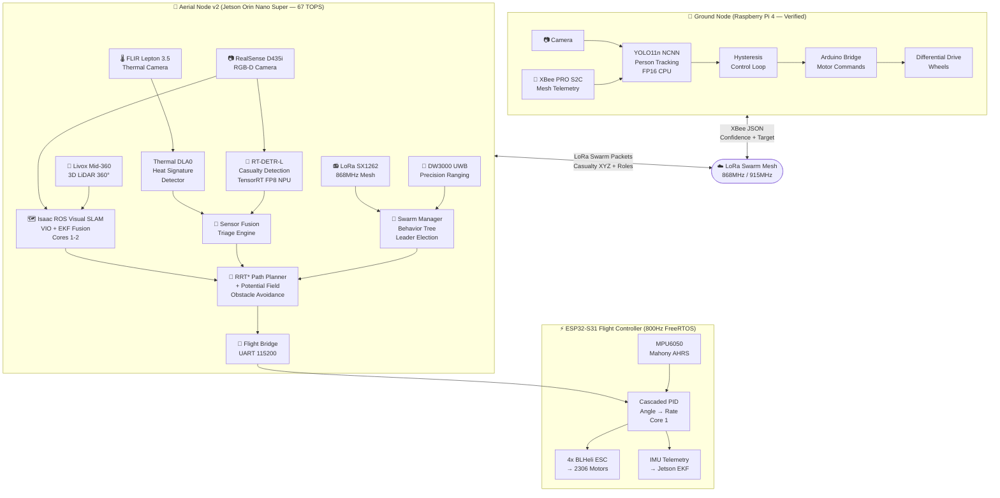
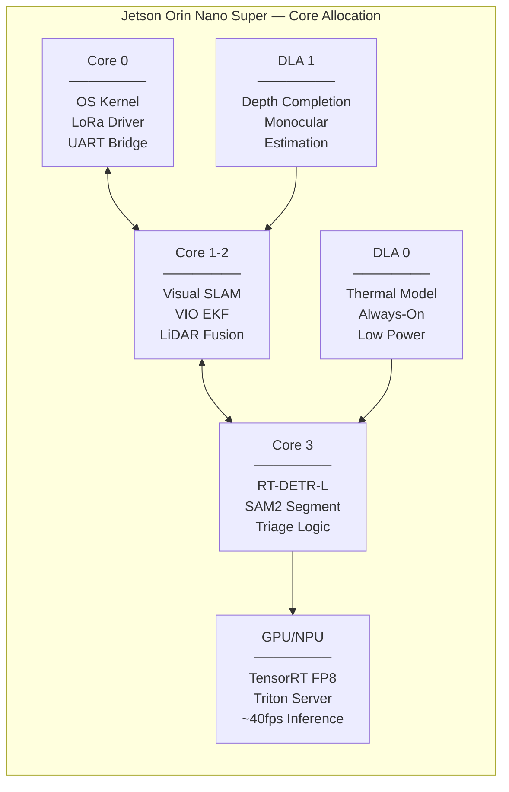

# Sentinel: Distributed Autonomous Aerospace & Ground Swarm

**Sentinel** is an advanced **IoRT (Internet of Robotic Things)** and **Edge AI** ecosystem. It is a custom-built, dual-layer autonomous swarm designed for high-performance object tracking and stabilized flight. By bridging on-device neural networking (Edge IoT) with decentralized Machine-to-Machine (M2M) mesh communication and high-speed aerospace flight control, Sentinel serves as a scalable, distributed physical computing platform built entirely from scratch without relying on black-box commercial flight controllers.

## Architecture Overview

The project is divided into two distinct processing nodes that can work collaboratively:

### 1. Aerial Node (`/aerial_node`)
Designed for **GPS-Denied Disaster Management**, the aerial drone pairs a high-performance flight controller with a next-gen edge companion computer.
*   **Edge Autonomy (Raspberry Pi 5 8GB):** Runs a multi-threaded Python engine heavily optimized for the Pi 5's Cortex-A76 cores. Core 1-2 run Monocular **Visual SLAM** for 3D mapping and navigation, while Core 3 runs a dedicated **YOLO11** NCNN pipeline for casualty detection.
*   **LoRa Telemetry:** Bypasses XBee and Wi-Fi to use an SPI-based SX1262 LoRa module for long-range, penetrating communication in disaster zones.
*   **"God-Mode" Flight Controller:** A scratch-built ESP32-S31 flight controller running Asymmetric FreeRTOS.
*   **ArduPilot-Grade Dynamics:** Implements a Cascaded PID architecture (Angle -> Rate) for locked-in stability.
*   **Mahony AHRS Sensor Fusion:** Fuses MPU6050 gyroscope and accelerometer data into 3D spatial orientation using advanced quaternion math.

### 2. Ground Node (`/ground_node`)
A tested and verified companion computer stack (Raspberry Pi + Arduino Bridge) for terrestrial tracking and swarm coordination.
*   **Neural Vision Engine:** Runs an optimized YOLO NCNN wrapper to track human targets in real-time.
*   **Mesh Communication:** Utilizes a lightweight XBee transport layer to broadcast tracking data between multiple swarm nodes.
*   **Hysteresis Control Loop:** Prevents mechanical jitter by implementing deadzone logic during active target pursuit.

## Experiments Conducted

Through extensive real-world testing, the ground-based tracking and communication layers have been verified. The following phases detail our experimental progress and milestones:

*   **Phase 0: Hardware Setup & Inspection (Complete)** - Initialized the chassis, Raspberry Pi, and XBee radios. Resolved brown-out issues by throttling YOLO CPU threads to `num_threads=1`.
*   **Phase 1: Motor Control (Complete)** - Achieved stable motor control bridging between the Pi and the low-level Arduino bridge.
*   **Phase 2: Serial Bridge Verification (Complete)** - Established reliable ASCII-based serial communication (115200 baud) between the Pi and motor controller.
*   **Phase 3: Vision Engine & YOLO (Complete)** - Successfully deployed YOLO11n (exported to NCNN FP16) natively on the Pi CPU for real-time person detection.
*   **Phase 4: Streaming & Telemetry (Complete)** - Set up debug streams to visualize tracking output without interfering with the main control loop.
*   **Phase 5: Hysteresis Tracking (Complete)** - Implemented visual tracking that commands motors dynamically while filtering out minor jitter using hysteresis deadzones.
*   **Phase 6: XBee Mesh Link Verification (Complete)** - Validated bidirectional JSON transport over XBee radios. Both nodes effectively transmit and receive target data, with the robot having the highest tracking confidence leading the pursuit.

**Pending Phases:**
*   **Phase 7: Full Cooperative Ground Test (Complete)** - Implemented a **Weighted Borda Count** leader election protocol. Every 100ms, each robot scores itself and all peers on a composite metric (`0.6×confidence + 0.3×freshness + 0.1×target_size`). The robot with the highest score becomes the **LEADER** and all others defer to its target coordinates. When all robots lose sight, they autonomously split into a coordinated scan sweep (A rotates right, B rotates left) to re-acquire.
*   **Phase 8: Forward-Drive + PID Integration** - Combining advanced PID dynamics with forward movement for smoother pursuit.

## Experiment Gallery

Here is a visual timeline of our physical prototyping and testing:

### 1. Hardware Base (Sentinel Ground Node)
The base robotics chassis for our ground testing, outfitted with Li-ion battery management, integrated H-bridges, and an Arduino-compatible pinout to bridge commands from the companion computer.

  
   
  <em>Top view: Sentinel Ground Node hardware base with serial bridge.</em>

  
   
  <em>Bottom view: Motors, wheels, and dual 14500 Li-ion cell power supply.</em>

### 2. XBee Mesh Network Telemetry
Verifying the XBee RF modules to establish a distributed mesh communication layer for the swarm, avoiding reliance on centralized Wi-Fi access points.

  
   
  <em>Digi XBee PRO S2C RF Module.</em>

  
  
   
  <em>Testing bidirectional serial telemetry (e.g. Hello World data packets) between nodes.</em>

  
   
  <em>Full telemetry loop test: Laptop transmitting to the Sentinel Ground Node (equipped with Raspberry Pi and XBee).</em>

### 3. Multi-Node Swarm & Vision Testing (YOLO)
Testing the YOLO vision engine to lock onto human targets. Swarm nodes communicate their confidence metrics over the XBee network, allowing multiple nodes to share visual tracking data.

  
   
  <em>Testing single and dual ground nodes tracking with YOLO bounding boxes streamed to the command center.</em>

  
   
  <em>Multi-node Swarm setup: Multiple Sentinel Ground Nodes coordinating target data while streaming YOLO feeds to multiple telemetry laptops.</em>

## Setup and Deployment
*Please refer to the individual `README.md` files inside each node directory for specific hardware wiring and compilation instructions.*