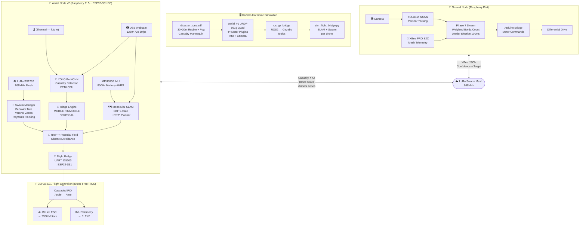
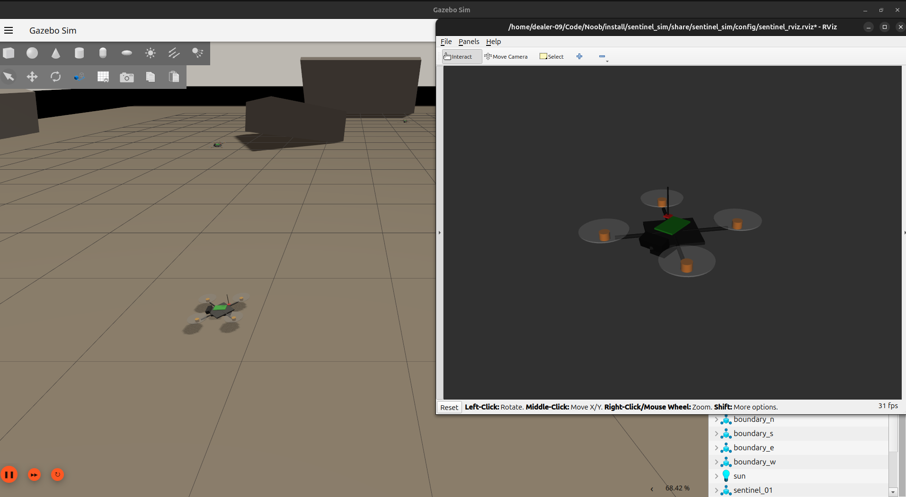
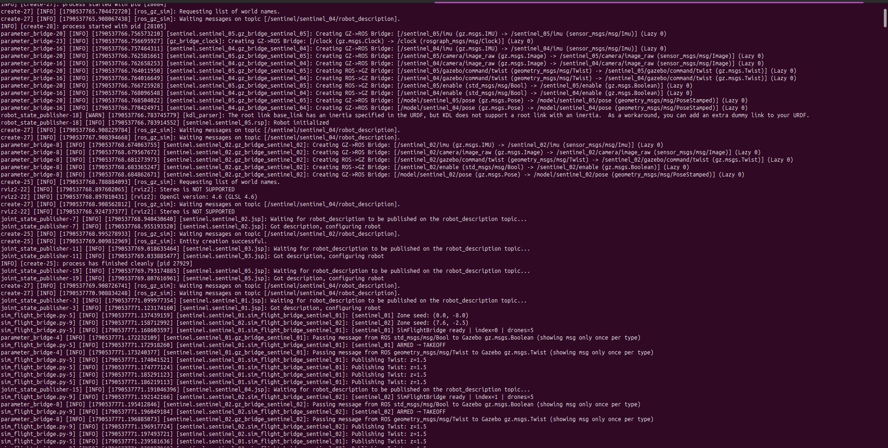
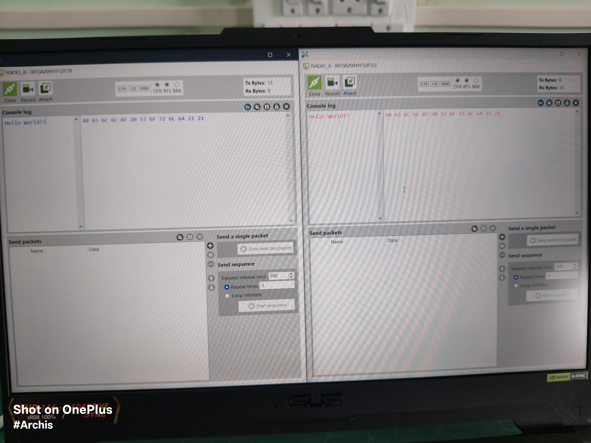
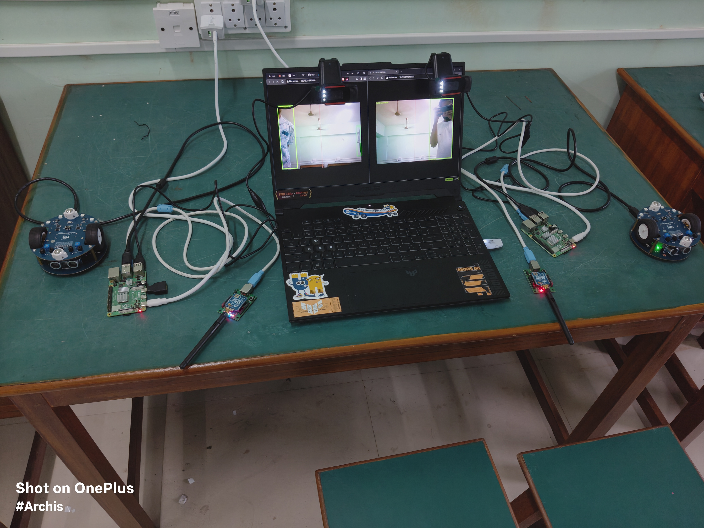

# Sentinel Swarm — GPS-Denied Disaster Management Drone Swarm

**Sentinel** is a fully custom-built, dual-layer autonomous swarm system for **GPS-denied disaster management**. It pairs a quadrotor aerial node with ground robots, coordinating via a LoRa/XBee mesh to search disaster zones, detect casualties using onboard AI, and relay positions back to a command center — all without GPS or external infrastructure.

Built entirely from scratch for a hackathon, with no black-box commercial flight controllers.


---

## Architecture Overview



---

## Repository Structure

```
Sentinel Swarm/
├── aerial_node/                  # v1 — Raspberry Pi 5 autonomy skeleton
│   ├── aerial_fc.ino             # ESP32-S31 FreeRTOS flight controller
│   ├── aerial_vision_node.py     # Pi 5 SLAM + YOLO scaffold (v1)
│   └── diagram.json / wokwi.toml # Wokwi simulation config
│
├── aerial_node_v2/               # v2 — Full autonomy stack (active)
│   ├── main.py                   # 20Hz master control loop
│   ├── flight_bridge/
│   │   └── flight_bridge.py      # UART bridge to ESP32 (P-ctrl velocity→attitude)
│   ├── slam/
│   │   └── sentinel_slam.py      # 9-state EKF + Voxel map + RRT* + Potential Field
│   ├── vision/
│   │   └── sentinel_vision.py    # RT-DETR / YOLO + thermal fusion + 3D localizer
│   └── swarm/
│       └── sentinel_swarm.py     # Behavior tree + Voronoi + Reynolds + LoRa mesh
│
├── ground_node/                  # Ground robot stack (verified hardware)
│   ├── shared/
│   │   ├── xbee_transport.py     # Thread-safe XBee JSON serial transport
│   │   └── yolo_ncnn.py          # YOLO11n NCNN wrapper for Pi CPU
│   ├── phase4_tracking/
│   │   └── ground_tracker.py     # Phase 4: symmetric peer tracking
│   ├── phase7_swarm_negotiation/
│   │   ├── swarm_negotiator.py   # Weighted Borda Count leader election
│   │   └── phase7_swarm_tracker.py # Phase 7 entry point
│   └── phase0_setup/             # Hardware setup scripts
│
├── simulation/                   # ROS2 Gazebo Harmonic sim (sentinel_sim pkg)
│   ├── package.xml
│   ├── CMakeLists.txt
│   ├── urdf/
│   │   └── aerial_v1.urdf        # 951g quad: 21 links, 4 motors, IMU, camera
│   ├── worlds/
│   │   └── disaster_zone.sdf     # 30×30m rubble zone with casualty mannequin
│   ├── launch/
│   │   └── aerial_v1_spawn.launch.py  # Multi-drone spawn + RViz2
│   ├── scripts/
│   │   └── sim_flight_bridge.py  # Per-drone SLAM+Swarm autonomy node
│   └── config/
│       └── sentinel_rviz.rviz    # Pre-configured RViz2 layout
│
└── assets/                       # Hardware photos
```

---

## Hardware

### Aerial Node
| Component | Part | Notes |
|---|---|---|
| Frame | ~250mm X-config quad | Carbon fibre arms |
| Flight Controller | ESP32-S31 | 800Hz FreeRTOS, custom firmware |
| Companion | Raspberry Pi 5 8GB | SLAM + YOLO + Swarm |
| IMU | MPU6050 | Mahony AHRS, 1kHz |
| Camera | USB Webcam | 1280×720 30fps, monocular SLAM |
| Radio | LoRa SX1262 | 868MHz mesh, swarm coordination |
| Battery | 4S 3300mAh LiPo | ~290g, below-frame mount |
| Motors | 2306 brushless | 4× BLHeli ESC |
| **Total mass** | **~951g** | Validated in URDF |

### Ground Node
| Component | Part |
|---|---|
| Companion | Raspberry Pi 4 |
| Radio | XBee PRO S2C |
| Vision | YOLO11n NCNN FP16 |
| Motor bridge | Arduino |
| Drive | Differential drive with L298N H-bridge |

---

## Simulation — Quick Start

Requires **ROS 2 Jazzy** + **Gazebo Harmonic** on Ubuntu 24.04 Noble.


```bash
# 1. Install dependencies (first time only)
sudo apt install ros-jazzy-desktop ros-jazzy-ros-gz \
                 ros-jazzy-robot-state-publisher \
                 ros-jazzy-joint-state-publisher gz-harmonic

# 2. Build the ROS2 package
cd /path/to/Sentinel-Swarm
source /opt/ros/jazzy/setup.bash
colcon build

# 3. Launch — 5 drones in circle formation with Gazebo + RViz2
source install/setup.bash
ros2 launch sentinel_sim aerial_v1_spawn.launch.py \
    num_drones:=5 formation:=circle rviz:=true
```

After ~8 seconds, all 5 drones arm and take off autonomously. Each drone:
1. Climbs to 3m hover altitude
2. Navigates to its assigned **Voronoi zone** using the real SLAM navigator
3. Searches for the casualty mannequin at `(-0.5, -9.0)` in the world
4. Transitions to **RESCUE HOVER** when it detects the casualty
5. Broadcasts its `DroneState` JSON to all peers via `/swarm/state/<id>` topics

**RViz2 setup (auto-configured):**
- Fixed Frame: `sentinel_01/base_link`
- TF Prefix: `sentinel_01`
- Description Topic: `/sentinel/sentinel_01/robot_description`

**Launch arguments:**

| Argument | Default | Options |
|---|---|---|
| `num_drones` | `1` | 1–100 |
| `formation` | `line` | `line` / `grid` / `circle` |
| `rviz` | `false` | `true` / `false` |
| `world` | `disaster_zone.sdf` | any `.sdf` path |

---

## Autonomy Stack

### SLAM — `sentinel_slam.py`
- **9-state EKF**: fuses IMU (accel + gyro) with VIO pose updates
- **Voxel occupancy map**: 100×100×100m at 0.1m resolution
- **RRT* global planner**: samples collision-free paths to waypoints
- **Dynamic Potential Field**: reactive obstacle avoidance at 20Hz
- Output: `(vx, vy, vz)` velocity commands clamped to 1.5 m/s

### Swarm — `sentinel_swarm.py`
- **Behavior Tree** (priority order): Low battery → RTB | Coverage gap → Relay | Casualty → Rescue | Else → Search
- **Voronoi partitioner**: divides the search zone evenly between N drones, zero overlap
- **Reynolds flocking**: separation + alignment + cohesion for formation hold
- **Leader election**: Bully algorithm, highest battery wins
- **Transport**: LoRa SX1262 on hardware; ROS2 topics in simulation

### Vision — `sentinel_vision.py`
- **Detection**: RT-DETR-L (Triton) with ONNX CPU fallback
- **Thermal fusion**: FLIR Lepton 33–38°C body temperature band
- **3D localization**: RealSense D435i depth or monocular fallback
- **Triage**: optical flow motion analysis → MOBILE / IMMOBILE / CRITICAL

### Flight Bridge — `flight_bridge.py`
- Simple P-controller: `(vx, vy) → (pitch, roll)` setpoints, gain Kv=2.5
- Wire format: `CMD,pitch,roll,thrust\n` over UART 115200 to ESP32
- IMU telemetry: `TEL,ax,ay,az,gx,gy,gz,bat_v\n` back to EKF
- Gracefully runs in simulation mode if serial port is unavailable

---

## Ground Node — Phase Progress

| Phase | Status | Description |
|---|---|---|
| Phase 0 | ✅ Complete | Hardware setup, brown-out fix (YOLO `num_threads=1`) |
| Phase 1 | ✅ Complete | Motor control via Pi→Arduino serial bridge |
| Phase 2 | ✅ Complete | ASCII serial 115200 baud verification |
| Phase 3 | ✅ Complete | YOLO11n NCNN FP16 on Pi CPU — real-time detection |
| Phase 4 | ✅ Complete | Symmetric peer tracking, best-confidence target selection |
| Phase 5 | ✅ Complete | Hysteresis deadzone tracking loop |
| Phase 6 | ✅ Complete | XBee bidirectional JSON mesh verified |
| Phase 7 | ✅ Complete | Weighted Borda Count leader election (100ms cycle) |
| Phase 8 | 🔄 Planned | PID forward-drive integration |

## Challenges Faced

During the integration of the Gazebo Harmonic simulation, several deep physics and architecture bugs were uncovered and resolved:

- **Propeller Collision Geometries:** The drone propellers were modeled with `<collision>` tags that overlapped with the main `base_link` geometry. In Gazebo Harmonic (DART physics engine), this caused an instant rigid-body jam upon spawn, preventing the rotors from spinning and entirely blocking lift-off despite active motor commands. Removing the collision geometries from the propellers resolved this.
- **URDF Templating Bug:** The `aerial_v1_spawn.launch.py` script was configured to read `aerial_v1.urdf` but passed it to Gazebo without substituting the `__DRONE_ID__` template marker for each drone instance. As a result, the `MulticopterVelocityControl` plugin subscribed to the generic `/__DRONE_ID__/gazebo/command/twist`, while the ROS-Gazebo bridge correctly published to the namespaced topic `/sentinel_01/gazebo/command/twist`. This silent mismatch was fixed by injecting the correct `drone_id` in Python before launching the State Publisher node.
- **Control Loop Shadowing:** In the `sim_flight_bridge.py` node, the `if self.armed:` branch was followed by an `elif self.phase == PHASE_TAKEOFF:`. Since the drone remained armed during flight, the `elif` branch was never reached, causing the control loop to forever publish zero-velocity Twist commands and hover indefinitely on the ground. Refactoring to independent `if` statements allowed the node to properly climb and navigate.
- **Ground Truth Pose Gap:** The original URDF lacked a `PosePublisher` plugin. Gazebo Harmonic does not publish `/model/NAME/pose` automatically, meaning the ROS bridge received nothing and the drone's altitude always registered as `0.0`. Injecting `gz::sim::systems::PosePublisher` (with `use_pose_vector_msg` set to `false` for standard `geometry_msgs/msg/PoseStamped` compatibility) closed the loop, enabling accurate altitude tracking and phase transitions.
- **XML Parsing Failures in Joint State Publisher:** The `joint_state_publisher` (which is needed to provide `0.0` angles for the continuous propeller joints to satisfy RViz) suddenly crashed with `xml.parsers.expat.ExpatError: not well-formed (invalid token)`. This was caused by standard ROS 2 CLI flags (like `--ros-args`) being accidentally placed inside an XML comment block (`<!-- ... -->`) in the URDF. The strict Python XML parser used by `joint_state_publisher` refuses double-dashes inside comments, unlike Gazebo's more lenient C++ `urdfdom` parser. Removing the double-dashes fixed the RViz TF tree errors entirely.

---

## Experiment Gallery

### Gazebo Harmonic & RViz2 Swarm Simulation

<p align="center">

  

  <br><em>Sentinel Swarm taking flight in Gazebo Harmonic with fully synchronized TF tree rendering in RViz2.</em>

</p>


### Simulation Terminal Logs

<p align="center">

  

  <br><em>Backend ROS 2 launch logs confirming Gazebo bridge initialization, swarm role allocation, and ARMED → TAKEOFF phase transitions.</em>

</p>

### 1. Hardware Base (Sentinel Ground Node)
The base robotics chassis for our ground testing, outfitted with Li-ion battery management, integrated H-bridges, and an Arduino-compatible pinout to bridge commands from the companion computer.

<p align="center">
  
  <br>
  <em>Top view: Sentinel Ground Node hardware base with serial bridge.</em>
</p>

<p align="center">
  
  <br>
  <em>Bottom view: Motors, wheels, and dual 14500 Li-ion cell power supply.</em>
</p>

### 2. XBee Mesh Network Telemetry
Verifying the XBee RF modules to establish a distributed mesh communication layer for the swarm, avoiding reliance on centralized Wi-Fi access points.

<p align="center">
  
  <br>
  <em>Digi XBee PRO S2C RF Module.</em>
</p>

<p align="center">
  
  
  <br>
  <em>Testing bidirectional serial telemetry (e.g. Hello World data packets) between nodes.</em>
</p>

<p align="center">
  
  <br>
  <em>Full telemetry loop test: Laptop transmitting to the Sentinel Ground Node (equipped with Raspberry Pi and XBee).</em>
</p>

### 3. Multi-Node Swarm & Vision Testing (YOLO)
Testing the YOLO vision engine to lock onto human targets. Swarm nodes communicate their confidence metrics over the XBee network, allowing multiple nodes to share visual tracking data.

<p align="center">
  
  <br>
  <em>Testing single and dual ground nodes tracking with YOLO bounding boxes streamed to the command center.</em>
</p>

<p align="center">
  
  <br>
  <em>Multi-node Swarm setup: Multiple Sentinel Ground Nodes coordinating target data while streaming YOLO feeds to multiple telemetry laptops.</em>
</p>

## Setup and Deployment
*Please refer to the individual `README.md` files inside each node directory for specific hardware wiring and compilation instructions.*
