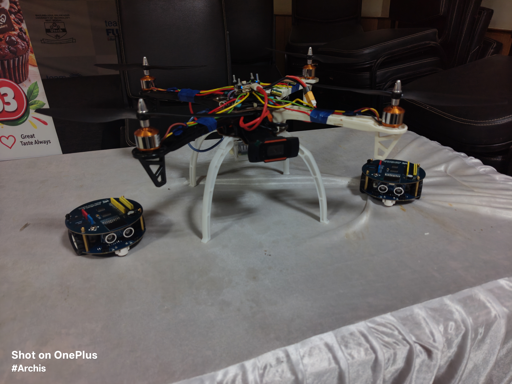
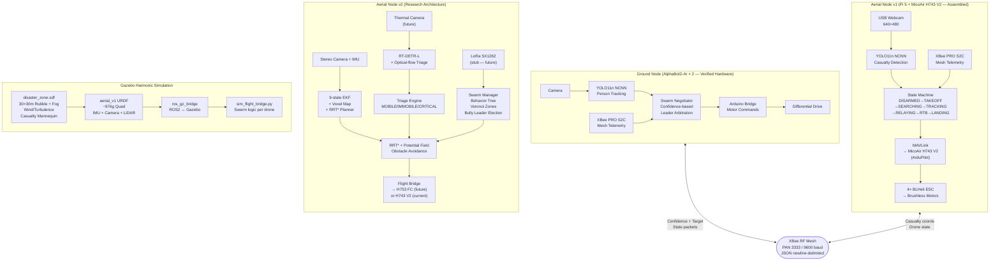
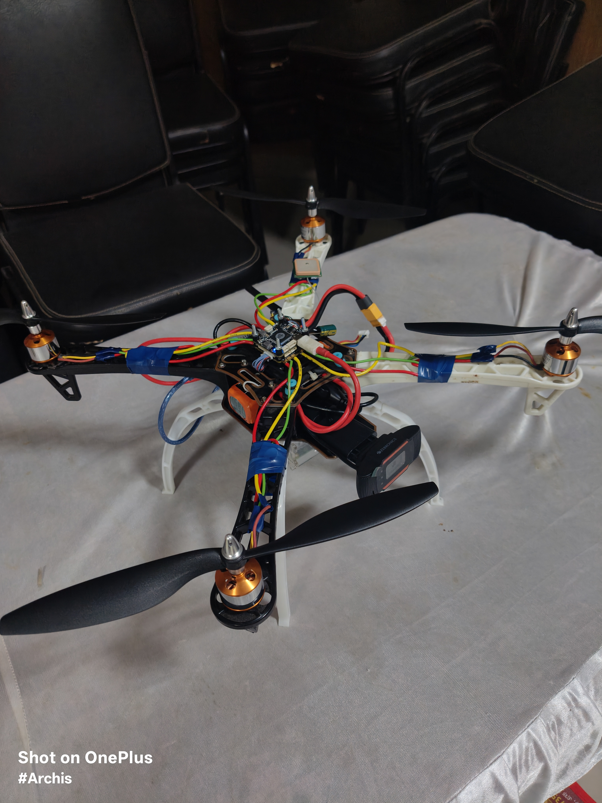
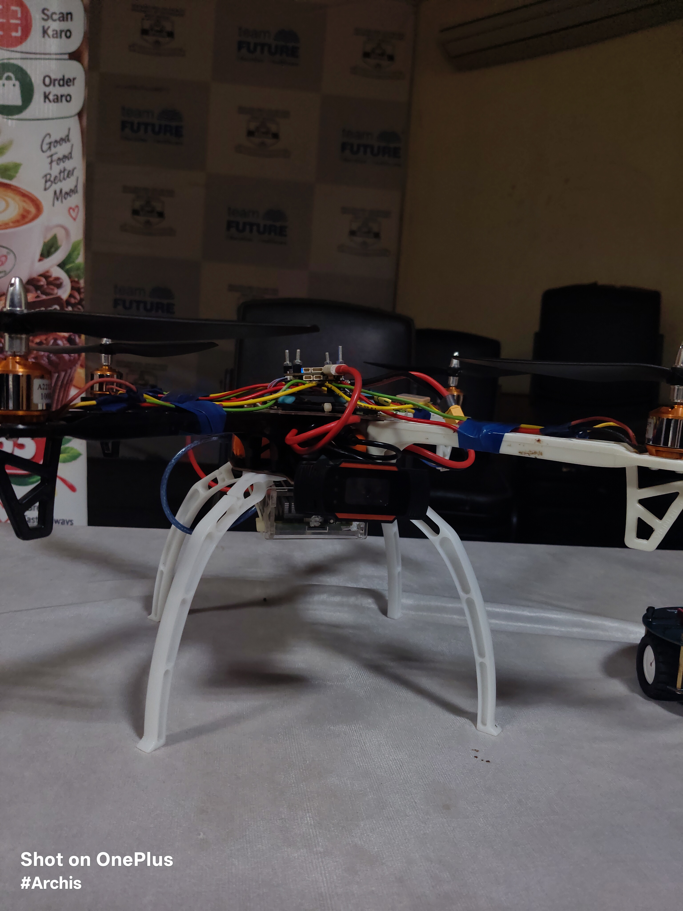
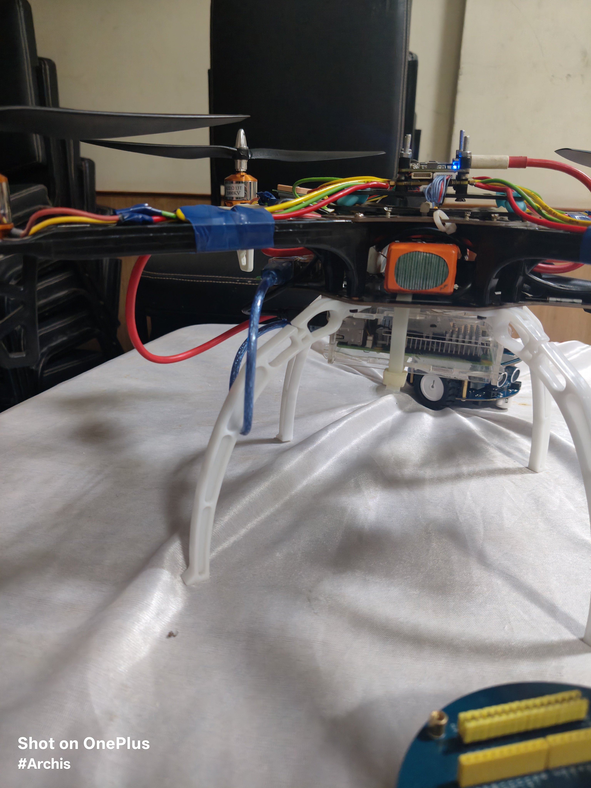
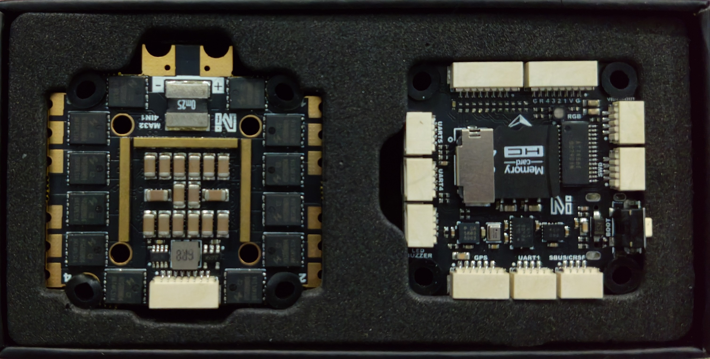

# Sentinel Swarm: GPS-Denied Disaster Management Autonomous Swarm

**Sentinel** is an **IoRT (Internet of Robotic Things)** and **Edge AI** swarm system engineered for GPS-denied disaster management. It deploys a decentralized, heterogeneous architecture pairing a quadrotor aerial node with two AlphaBot2-Ar ground robots, all coordinating over a self-healing **XBee RF mesh network**.

<p align="center">
  
  <br><em><b>Physical Heterogeneous Swarm Fleet</b>: Central quadrotor aerial platform flanked by the dual AlphaBot2-Ar ground nodes.</em>
</p>

The project is structured in three tiers:

| Tier | Status | Description |
|---|---|---|
| **Ground PoC** | ✅ Verified on hardware | 2× AlphaBot2-Ar robots — proves peer-information + decentralized decision on real hardware |
| **Aerial v1** | ✅ Assembled & integrated | Pi 5 + MicoAir H743 V2 + ArduPilot — first aerial hardware implementation |
| **Research / Sim** | 🔬 Architecture prototype | Gazebo Harmonic multi-drone sim + advanced v2 autonomy scaffold |

> **The AlphaBot2-Ars are not a temporary stepping stone.** They are retained as active swarm members and are the strongest experimental evidence of the project's core thesis: *separate autonomous agents can exchange state and use information from another agent in their own decision process.*

---

## Project Thesis

The goal is not to build a drone swarm. It is to develop a **common autonomous cooperation layer that coordinates different robot morphologies** — ground robots, quadrotors, and eventually quadrupeds or other platforms — while proving the cooperation mechanism first on affordable hardware and progressively transferring it to aerial and other platforms.

```
                   NEXIS / SENTINEL
                         │
          ┌──────────────┼──────────────┐
          │              │              │
          ▼              ▼              ▼
    GROUND PoC       AERIAL v1     AERIAL v2 / SIM
    PHYSICAL         PHYSICAL      RESEARCH STACK
          │              │              │
  2 AlphaBots       Pi 5 + H743    Jetson-oriented
  Pi 4B             ArduPilot      autonomy design
  XBee              XBee
  YOLO11n NCNN      YOLO11n NCNN
  Arduino           MAVLink
          │              │              │
          └──────┬────────┘──────┬──────┘
                 ▼               ▼
         Common information layer
                 │
     sensing + partner information
                 │
           local decision
                 │
       task / route / hazard / unsafe-area
```

**Future heterogeneous swarm members** (all sharing the same information layer):
- Ground rovers → narrow indoor spaces
- Quadrotors → aerial overview + open terrain
- Quadrupeds → irregular rubble where wheels fail
- Folding/morphing UAVs → constrained passages

---

## Architecture Overview



---

## Repository Structure

```
Sentinel-Swarm/
├── aerial_node/                  # v1 — Physical aerial stack (ArduPilot)
│   ├── drone_companion.py        # Full state machine: DISARMED→LANDING (MAVLink)
│   ├── drone_vision_nav.py       # GPS-denied vision nav: ALT_HOLD + YOLO PID
│   ├── motor_test.py             # FC health check + manual motor test utility
│   ├── aerial_fc.ino             # ESP32-S31 experimental backup FC (not primary)
│   └── aerial_vision_node.py     # v1 SLAM scaffold (prototype)
│
├── aerial_node_v2/               # v2 — Research autonomy stack (scaffold)
│   ├── main.py                   # 20Hz master control loop
│   ├── flight_bridge/
│   │   └── flight_bridge.py      # UART bridge (P-ctrl velocity→attitude)
│   ├── slam/
│   │   └── sentinel_slam.py      # 9-state EKF + 32m Voxel map + RRT*
│   ├── vision/
│   │   └── sentinel_vision.py    # RT-DETR + optical-flow triage (thermal/depth: future)
│   └── swarm/
│       └── sentinel_swarm.py     # Behavior tree + Voronoi + Bully election + LoRa stub
│
├── ground_node/                  # Ground robot stack (verified on hardware)
│   ├── shared/
│   │   ├── xbee_transport.py     # Thread-safe XBee JSON serial transport
│   │   └── yolo_ncnn.py          # YOLO11n NCNN wrapper for Pi CPU
│   ├── phase4_tracking/
│   │   └── ground_tracker.py     # Phase 4: symmetric peer tracking
│   └── phase7_swarm_negotiation/
│       ├── swarm_negotiator.py   # Confidence-based leader arbitration
│       └── phase7_swarm_tracker.py  # Phase 7 entry point (deployed runtime)
│
├── simulation/                   # ROS2 Jazzy + Gazebo Harmonic (sentinel_sim)
│   ├── package.xml / CMakeLists.txt
│   ├── urdf/aerial_v1.urdf       # ~976g quad: 21 links, IMU, RGB, thermal, 2D LiDAR
│   ├── worlds/disaster_zone.sdf  # 30×30m rubble, wind/fog, thermal casualty mannequin
│   ├── launch/aerial_v1_spawn.launch.py  # Multi-drone spawn + RViz2
│   ├── scripts/sim_flight_bridge.py      # Per-drone swarm autonomy node
│   └── config/sentinel_rviz.rviz
│
└── assets/                       # Hardware photos, logs, simulation screenshots
```

---

## Hardware

### Aerial Node — v1 (Physical, Assembled)
| Component | Part | Notes |
|---|---|---|
| Frame | ~250mm X-config quad | Carbon fibre arms |
| **Flight Controller** | **MicoAir H743 V2** | **STM32H743, ArduPilot firmware** |
| Companion | Raspberry Pi 5 8GB | YOLO + MAVLink + XBee swarm |
| Camera | USB Webcam | 640×480, vision navigation |
| Radio | XBee PRO S2C | 2.4GHz mesh, PAN ID 3333 |
| Battery | 4S LiPo | below-frame mount |
| Motors | Brushless, 4× BLHeli ESC | DShot600 |

> **Note:** The ESP32-S31 (`aerial_fc.ino`) is an experimental backup FC path and is **not** the primary aerial hardware. The deployed physical system uses the MicoAir H743 V2 running ArduPilot.

### Aerial Node — v2 (Future Proposition)
| Component | Part | Notes |
|---|---|---|
| Companion | Nvidia Jetson Nano | Heavier vision workloads / ViT |
| Camera | Stereo + IMU | VIO-capable |
| Thermal | FLIR Lepton | 160×120, 10Hz |
| LiDAR | 3D LiDAR | Full 3D voxel mapping |
| Flight Controller | H753-based | Higher-compute FC |
| Radio | LoRa SX1262 | 868MHz (driver not yet implemented) |

### Ground Node (AlphaBot2-Ar × 2 — Verified Hardware)
| Component | Part |
|---|---|
| Companion | Raspberry Pi 4B |
| Radio | XBee PRO S2C |
| Vision | YOLO11n NCNN FP16 (320×320) |
| Motor bridge | Arduino |
| Drive | Differential drive with L298N H-bridge |

---

## Ground Node — Phase Progress

| Phase | Status | Description |
|---|---|---|
| Phase 0 | ✅ Complete | Hardware setup, brown-out fix (YOLO `num_threads=1`) |
| Phase 1 | ✅ Complete | Motor control via Pi→Arduino serial bridge |
| Phase 2 | ✅ Complete | ASCII serial 115200 baud verification |
| Phase 3 | ✅ Complete | YOLO11n NCNN FP16 on Pi CPU — real-time detection |
| Phase 4 | ✅ Complete | Symmetric peer tracking, best-confidence target selection |
| Phase 5 | ✅ Complete | Hysteresis deadzone tracking loop |
| Phase 6 | ✅ Complete | XBee bidirectional JSON mesh verified |
| Phase 7 | ✅ Complete | Confidence-based leader arbitration (100ms cycle) |
| Phase 8 | 🔄 Planned | PID forward-drive integration |

---

## Simulation — Quick Start

Requires **ROS 2 Jazzy** + **Gazebo Harmonic** on Ubuntu 24.04 Noble.

```bash
# 1. Install dependencies (first time only)
sudo apt install ros-jazzy-desktop ros-jazzy-ros-gz \
                 ros-jazzy-robot-state-publisher \
                 ros-jazzy-joint-state-publisher gz-harmonic

# 2. Build the ROS2 package
cd /path/to/Sentinel-Swarm
source /opt/ros/jazzy/setup.bash
colcon build

# 3. Launch — 5 drones in circle formation with Gazebo + RViz2
source install/setup.bash
ros2 launch sentinel_sim aerial_v1_spawn.launch.py \
    num_drones:=5 formation:=circle rviz:=true
```

After ~8 seconds, all drones arm and take off. Each drone:
1. Climbs to 3m hover altitude
2. Navigates to its assigned **Voronoi zone**
3. Searches for the casualty mannequin using RGB colour segmentation (proxy detector)
4. Transitions to **RESCUE HOVER** on detection
5. Broadcasts `DroneState` to all peers via `/swarm/state/<id>` ROS 2 topics
6. Deconflicts rescue assignment — nearest searching drone handles the casualty

> **Simulation perception note:** The simulator uses RGB colour segmentation as a proxy detector, not the real RT-DETR/YOLO models. The thermal camera and 3D LiDAR are modelled in the world/URDF but are not yet consumed by the active autonomy logic. The 2D planar LiDAR validates obstacle-aware navigation, not full 3D rubble mapping.

**Launch arguments:**

| Argument | Default | Options |
|---|---|---|
| `num_drones` | `1` | 1–100 |
| `formation` | `line` | `line` / `grid` / `circle` |
| `rviz` | `false` | `true` / `false` |
| `world` | `disaster_zone.sdf` | any `.sdf` path |

---

## Autonomy Stack

### v1 Aerial State Machine — `drone_companion.py` / `drone_vision_nav.py`
```
DISARMED → ARMED → TAKEOFF → SEARCHING → TRACKING → RELAYING → RTB → LANDING
```
- **FC interface:** MAVLink via `pymavlink` → MicoAir H743 V2 (ArduPilot)
- **GPS-denied flight:** `ALT_HOLD` mode + barometer Z-axis, bypasses EKF geographic lock
- **Vision control:** YOLO bounding-box pixel error → P-controller → raw RC channel overrides
- **Swarm awareness:** Receives XBee detections from ground bots; partner confidence can trigger state transitions
- **Safety:** FC heartbeat timeout → hover; `atexit` hook forces DISARM on any script exit

### v2 Research Stack — `aerial_node_v2/` (Scaffold)

| Module | What exists | What is still a stub |
|---|---|---|
| SLAM `sentinel_slam.py` | 9-state EKF architecture, 32m voxel map, RRT*, potential field | Gravity compensation, bias estimation, full IMU calibration chain |
| Vision `sentinel_vision.py` | RT-DETR inference interface, ONNX fallback, optical-flow triage | Real thermal capture, depth fusion (passes `None`), Grounded-SAM2 |
| Swarm `sentinel_swarm.py` | Behavior tree, Voronoi partition, Reynolds flocking, Bully election, peer table | Actual LoRa SX1262 driver and transmission (currently no-op) |
| Flight Bridge | UART protocol design, sim passthrough | Real battery/thrust feedback (`battery=0.95` placeholder) |

### Ground Swarm — `ground_node/`
- **Transport:** XBee transparent mode, AP=0, PAN 3333, 9600 baud, newline-delimited JSON
- **Detection:** YOLO11n NCNN FP16, 320×320, person class only, 4 CPU threads
- **Decision:** Robot reads own detection + partner's broadcast → selects highest-confidence source → issues motor command
- **Demonstrated:** `[self]` and `[partner]` states reaching runtime decision logic, LEFT/RIGHT/CNTR commands, and graceful `No target — stopped`

---

## Deployment Quick Commands

```powershell
# ==================================
# Ground Bot A
# ==================================
ssh -t -o StrictHostKeyChecking=no pi@10.219.37.74 "PYTHONUNBUFFERED=1 ~/swarm_venv/bin/python ~/swarm_bot.py --id A --stream"
# Stream: http://10.219.37.74:5000
# Kill:   ssh pi@10.219.37.74 "pkill -2 -f python"

# ==================================
# Ground Bot B
# ==================================
ssh -t -o StrictHostKeyChecking=no pi2@10.219.37.184 "PYTHONUNBUFFERED=1 ~/swarm_venv/bin/python ~/swarm_bot.py --id B --stream"
# Stream: http://10.219.37.184:5000
# Kill:   ssh pi2@10.219.37.184 "pkill -2 -f python"

# ==================================
# Aerial Drone (GPS-Denied Vision Nav)
# ==================================
ssh -t -o StrictHostKeyChecking=no pi3@10.219.37.160 "source ~/drone_venv/bin/activate && python ~/Noob/aerial_node/drone_vision_nav.py"
# Stream: http://10.219.37.160:5000
# Kill:   ssh pi3@10.219.37.160 "pkill -2 -f python"
# ⚠️  Always use pkill -2 (not -9). The script's atexit hook disarms the FC motors.
#     pkill -9 skips the hook and leaves motors running.
```

---

## Challenges Faced

### Simulation & Architecture

- **Propeller Collision Geometries:** Propellers modelled with `<collision>` tags overlapping `base_link` caused an instant rigid-body jam in Gazebo Harmonic's DART physics engine, blocking lift-off despite active motor commands. Removing collision geometry from rotors resolved this.
- **URDF Templating Bug:** `aerial_v1_spawn.launch.py` passed the URDF to Gazebo without substituting the `__DRONE_ID__` marker. The velocity plugin subscribed to `/__DRONE_ID__/gazebo/command/twist` while the bridge published to `/sentinel_01/...`. Injecting the correct `drone_id` in Python before launch fixed the silent mismatch.
- **Control Loop Shadowing:** `if self.armed: ... elif self.phase == PHASE_TAKEOFF:` — since the drone stays armed during flight, the `elif` was never reached, causing permanent zero-velocity hover. Refactoring to independent `if` statements fixed phase progression.
- **Ground Truth Pose Gap:** Gazebo Harmonic does not publish `/model/NAME/pose` automatically. The drone's altitude always read `0.0`. Injecting `gz::sim::systems::PosePublisher` closed the loop.
- **Gazebo PosePublisher Memory Crash:** Having `<static_publisher>true</static_publisher>` with `<publish_link_pose>false</publish_link_pose>` triggered a `std::length_error` in the C++ allocator. Disabling the static publisher flag resolved it.
- **Voxel Map False-Obstacle Boxing:** Maximum-range LiDAR rays (empty space) were treated as solid hits, boxing the drone inside a 20m obstacle sphere. An `np.isfinite` hit-mask before ray-casting restored proper free-space carving.
- **Nvidia PRIME GPU Offload:** Gazebo defaulted to integrated Radeon graphics on an Optimus laptop, causing severe frame drops. Forcing `__NV_PRIME_RENDER_OFFLOAD=1 __GLX_VENDOR_LIBRARY_NAME=nvidia` stabilized the frame rate.

### Real Hardware & Integration

- **Swarm Network DDoS (XBee Packet Collisions):** Once the drone's YOLO ran at 30 FPS, it broadcast coordinates every frame, saturating the 9600-baud RF channel and causing garbled JSON packets on the ground bots. Implementing a strict 2Hz rate-limiter on the drone's transmit loop immediately cleared the collisions.
- **ArduPilot EKF Blocking GPS-Denied Flight:** ArduPilot's Extended Kalman Filter rejected ARM commands and `GUIDED` mode indoors without a geographic lock. We overhauled the flight script to use `ALT_HOLD` mode and replaced autonomous waypoints with a YOLO pixel-error P-controller driving raw MAVLink RC overrides — bypassing the EKF check entirely.
- **Ghost Processes and Runaway Motors:** Disabling the Radio Failsafe (`FS_THR_ENABLE=0`) to allow MAVLink arming without an RC transmitter meant that `pkill -9` left ArduPilot holding the last throttle value indefinitely. We injected an `atexit` hook into the companion script that fires `MAV_CMD_COMPONENT_ARM_DISARM` and zeroes all throttle channels before the Python process closes — regardless of how it is killed.
- **Flight Controller Hardware Trace Fault:** Motor 4 was dead despite exhaustive protocol testing (DShot600, OneShot125, Analog PWM). We isolated the variable by wiring an ESP32 directly to the ESC — the motor spun perfectly. The physical copper trace on the MicoAir H743 board for Pin 4 was burnt out. We solved it by soldering a bypass wire to the M5 pad and remapping `SERVO4_FUNCTION` in ArduPilot.
- **Corrupted SD Card:** The FC's SD card suffered severe filesystem corruption (`WinError 1392` on every `.BIN` log), blocking Blackbox telemetry analysis. Running the FC without the SD card eliminated logging-related DMA contention on the STM32H743.

---

## Experiment Gallery

### 1. Physical Heterogeneous Swarm Fleet

<p align="center">
  
  <br><em>Complete physical heterogeneous swarm: Central quadrotor aerial platform flanked by the dual AlphaBot2-Ar ground nodes.</em>
</p>

### 2. Aerial Node v1 — Physical Assembly & Avionics

<p align="center">
  
  
  <br><em>Left: Assembled quadrotor top view showing MicoAir H743 V2 FC, ESC wiring harness, and 4S LiPo mount. Right: Profile view showing landing legs, motor mountings, and companion computer bay.</em>
</p>

<p align="center">
  
  
  <br><em>Left: Underslung Raspberry Pi 5 companion computer and forward-facing vision camera. Right: High-power MicoAir H743 V2 STM32H743 flight controller and 4-in-1 ESC power distribution board.</em>
</p>

### 3. Integrated Ground Nodes (AlphaBot2-Ar)

<p align="center">
  
  <br><em>Fully integrated AlphaBot2-Ar ground node equipped with Raspberry Pi 4B, tracking camera, and XBee-PRO S2C wireless mesh transceiver (aerial platform in testing background).</em>
</p>

<p align="center">
  
  
  <br><em>Top view: Sentinel Ground Node hardware base with serial bridge. Bottom view: Motors, wheels, and dual 14500 Li-ion cell power supply.</em>
</p>

### 4. XBee Mesh Network Telemetry

<p align="center">
  
  <br><em>Digi XBee PRO S2C RF Module.</em>
</p>

<p align="center">
  
  
  <br><em>Testing bidirectional serial telemetry between nodes.</em>
</p>

<p align="center">
  
  <br><em>Full telemetry loop test: Laptop transmitting to the Sentinel Ground Node.</em>
</p>

### 5. Multi-Node Swarm & Vision Testing (YOLO)

<p align="center">
  
  <br><em>Testing single and dual ground nodes tracking with YOLO bounding boxes streamed to the command center.</em>
</p>

<p align="center">
  
  <br><em>Multi-node Swarm setup: Multiple Sentinel Ground Nodes coordinating target data while streaming YOLO feeds.</em>
</p>

<p align="center">
  
  <br><em>Real-time swarm negotiation logs over XBee. The active node dynamically switches pursuit leadership between <code>[ self ]</code> and <code>[partner]</code> based on YOLO confidence, issuing <code>M,speed,dir,speed,dir</code> motor commands.</em>
</p>

### 6. Gazebo Harmonic & RViz2 Swarm Simulation

<p align="center">
  
  <br><em>Sentinel Swarm taking flight in Gazebo Harmonic with fully synchronized TF tree rendering in RViz2.</em>
</p>

### Simulation Terminal Logs

<p align="center">
  
  <br><em>Backend ROS 2 launch logs confirming Gazebo bridge initialization, swarm role allocation, and ARMED → TAKEOFF phase transitions.</em>
</p>

---

## Setup and Deployment

*Please refer to the individual `README.md` files inside each node directory for specific hardware wiring and compilation instructions.*
